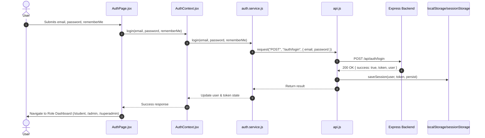
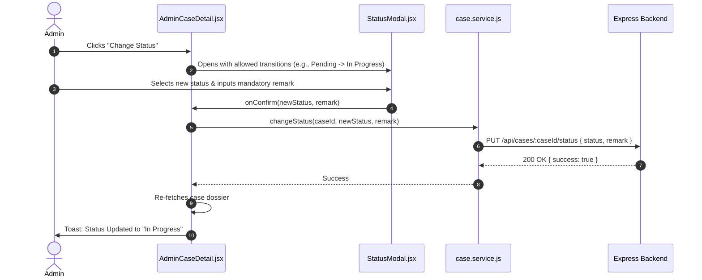
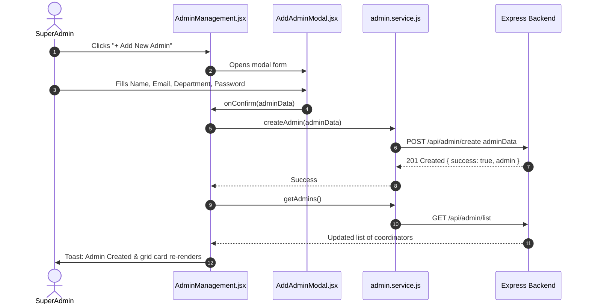
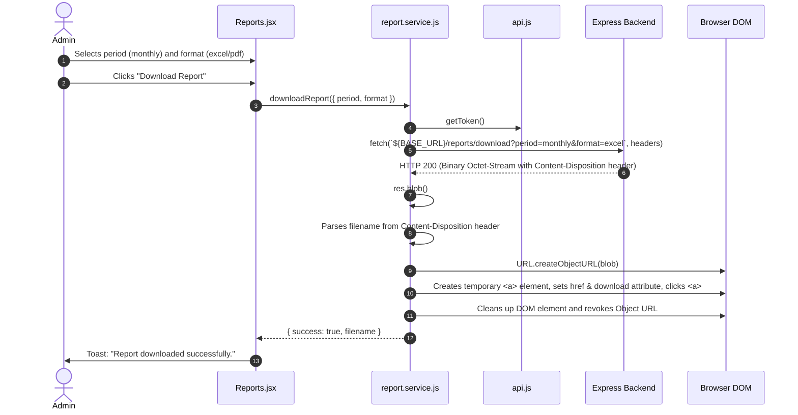

# Data Flow Specification — Grievance.io 2.0

## 1. General Data Flow Pattern

All user interactions and data mutations follow a unidirectional, predictable lifecycle:

```text
User Interaction (Click, Submit, Input)
       │
       ▼
React Component / Page View
       │
       ▼
Local Hook / Context Dispatcher
       │
       ▼
Domain Service (`*.service.js`)
       │
       ▼
API Client (`api.js`)
       │  (Injects Authorization: Bearer JWT & Base URL)
       ▼
Backend Express / MongoDB Server
       │
       ▼
HTTP Response (JSON or Binary Blob)
       │
       ▼
Promise Resolution / Error Interception
       │
       ▼
State Update (Context or `useState`)
       │
       ▼
Declarative React Re-render & User Feedback (Toast / Modal)
```

---

## 2. Concrete Workflow Traces

### 2.1 Authentication & Login Flow



1. **User Action**: The user inputs credentials and chooses whether to check "Remember me".
2. **Form Handler**: `AuthPage.jsx` validates input presence and triggers `login()` from `useAuth()`.
3. **Service Layer**: `authService.login()` prepares JSON payload.
4. **Client Layer**: `API.request()` executes HTTP `POST /api/auth/login`.
5. **Storage Persistence**:
   - If `rememberMe === true`: Writes to `localStorage` under `grievance_session`.
   - If `rememberMe === false`: Writes to `sessionStorage` under `grievance_session`.
6. **State & Redirection**: `AuthContext` updates its `user` and `token` states; `AuthPage` redirects to the appropriate dashboard matching `user.role`.

---

### 2.2 Student Grievance Filing (Multipart FormData)

```mermaid
sequenceDiagram
    autonumber
    actor Student
    participant Page as StudentNewGrievance.jsx
    participant CaseService as case.service.js
    participant API as api.js
    participant Backend as Express Backend

    Student->>Page: Fills Category, Subject, Description, Attachments
    Student->>Page: Clicks "Submit Grievance"
    Page->>Page: Builds FormData with multipart files
    Page->>CaseService: fileGrievance(formData)
    CaseService->>API: request("POST", "/cases", formData, isFormData=true)
    API->>API: Injects Bearer JWT; omits manual Content-Type (browser sets boundary)
    API->>Backend: POST /api/cases
    Backend-->>API: 201 Created { success: true, case: { caseId: "G-1025", ... } }
    API-->>CaseService: Case record
    CaseService-->>Page: Success response
    Page->>Student: Toast: "Grievance Filed!" & Navigate to /student/cases/G-1025
```

---

### 2.3 Real-Time Case Messaging Flow

```mermaid
sequenceDiagram
    autonumber
    actor Participant as Student / Coordinator
    participant DetailPage as CaseDetail.jsx
    participant ChatInput as ChatInput.jsx
    participant CaseService as case.service.js
    participant API as api.js
    participant Backend as Express Backend

    Participant->>ChatInput: Types message text & clicks Send
    ChatInput->>DetailPage: onSend(text)
    DetailPage->>CaseService: sendMessage(caseId, text, isInternal=false)
    CaseService->>API: request("POST", `/cases/${caseId}/message`, { text, isInternal })
    API->>Backend: POST /api/cases/:caseId/message
    Backend-->>API: 200 OK { success: true }
    API-->>DetailPage: Success
    DetailPage->>CaseService: getCaseById(caseId)
    CaseService->>Backend: GET /api/cases/:caseId
    Backend-->>CaseService: Updated case with appended message in thread
    CaseService-->>DetailPage: Updated case state
    DetailPage->>DetailPage: Re-renders ChatThread & scrolls to bottom
```

---

### 2.4 Admin Status Transition Flow



---

### 2.5 Super Admin Coordinator Management Flow



---

### 2.6 Binary Report Export & Blob Download


